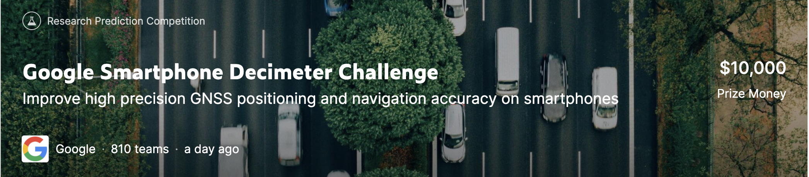
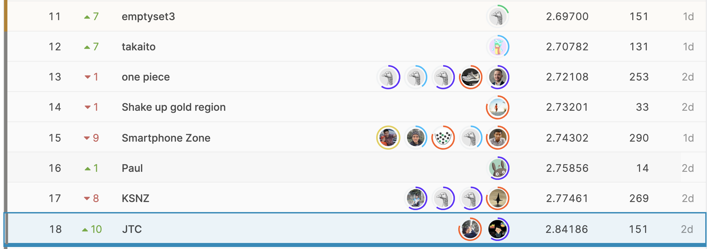
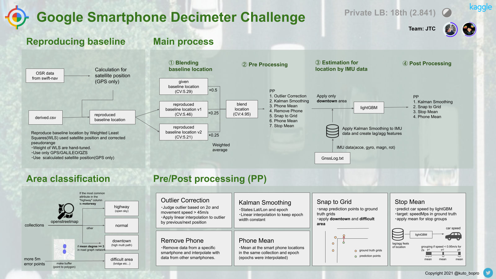

# kaggle-outdoor
Google Smartphone Decimeter Challenge in kaggle

## Logs
[Notion](https://holly-gum-a87.notion.site/outdoor-31eb0b3564764a21aae007e42bac50e0)
  
  
## Result
18th/810 (silver medal)

  
   
## Solution

More detail is [here](https://www.kaggle.com/c/google-smartphone-decimeter-challenge/discussion/261774)
  
  
## Output
### Notebook
- [Road detection and creating grid points](https://www.kaggle.com/kuto0633/road-detection-and-creating-grid-points)
- [Reproducing baseline by estimating each isrbM](https://www.kaggle.com/kuto0633/reproducing-baseline-by-estimating-each-isrbm)
  
  
### Discussion
- ["Snap to Grid" is valid for this competition.](https://www.kaggle.com/c/google-smartphone-decimeter-challenge/discussion/245060)
- [Public/Private data were sepaleted by collections](https://www.kaggle.com/c/google-smartphone-decimeter-challenge/discussion/250977)
- [Is it okay to apply specific post-processing "manually" to a specific collection(or area)?](https://www.kaggle.com/c/google-smartphone-decimeter-challenge/discussion/251998)
- [How can I Reproduce baseline from derived file?](https://www.kaggle.com/c/google-smartphone-decimeter-challenge/discussion/255536)
- [18th Place Solution](https://www.kaggle.com/c/google-smartphone-decimeter-challenge/discussion/261774)